# 🚗 Geely EX2 — bộ app điều khiển xe

**3 app, mỗi cái chạy trên một thiết bị: màn hình xe · điện thoại · máy tính.**

💬 Nhóm Zalo hỗ trợ / trao đổi: **[zalo.me/g/knl7dndglibpuzclc4vg](https://zalo.me/g/knl7dndglibpuzclc4vg)**

---

## 🌟 Vì sao nên dùng bộ app này?

> **Biến Geely EX2 thành chiếc xe bạn điều khiển được — từ ghế lái, từ điện thoại, từ máy tính.**

- 🎙️ **Nói tiếng Việt là xe nghe** — 75 lệnh điều khiển + 15 câu hỏi trả lời bằng giọng nói,
  nhận dạng **offline** (không cần mạng, không gửi giọng lên server), **đạt 95% đúng lệnh**
  đo trên 606 lượt nói thật với 3 giọng Bắc – Trung – Nam.
- 📱 **Điều khiển xe từ điện thoại** — chỉnh điều hoà, khoá/mở cửa, kính, đèn… qua Bluetooth,
  WiFi hoặc 4G khi xe đang bật (ACC / nổ máy), tiện lợi cho người ngồi ghế sau hoặc lúc đỗ xe nghỉ ngơi.
- 🧊 **Điều hoà theo lịch & đa bước (AC program)** — tự động hoá chuỗi tác vụ làm mát, làm ấm,
  chạy ngầm ổn định khi xe hoạt động.
- 📲 **Cài app cho xe không cần máy tính, không cần ADB** — chọn trong danh mục "Cài nhanh"
  rồi bấm cài, ngay trên màn xe hoặc từ điện thoại.
- 📊 **Thông tin xe luôn trước mắt** — pin %, tốc độ, nhiệt độ ngoài trời hiện thẳng trên
  thanh trạng thái; chế độ lái, đèn viền, độ sáng đèn pha chỉnh trong 1 chạm.
- 🛟 **Có đường lùi khi lỡ tay** — PCConnect cứu hộ qua ADB, watchdog tự khôi phục khi app
  lỗi, cập nhật thẳng từ GitHub.
- 🔒 **An toàn cho xe theo thiết kế** — app **không đụng tới phân vùng `/system`**, không
  cần root, không unlock bootloader: cài vào là dùng, gỡ ra là xe về nguyên trạng.
- 🔑 **Cần mã kích hoạt để dùng — bộ app này không miễn phí.** Tải file ở dưới rồi
  kích hoạt bằng **mã + số điện thoại** do quản trị viên cấp (1 mã = 1 người).
  Liên hệ nhóm Zalo bên trên để được cấp mã. Trong app không có quảng cáo.

---

## 📚 Mục lục

1. [Vì sao nên dùng bộ app này?](#-vì-sao-nên-dùng-bộ-app-này)
2. [Các app trong kho này](#-các-app-trong-kho-này)
3. [Giao diện & Tính năng từng app](#-giao-diện--tính-năng-từng-app)
   - [🚗 Car Connect (Màn hình xe)](#-car-connect--app-trên-màn-hình-xe)
   - [📱 Phone Connect (Điện thoại)](#-phone-connect--app-điện-thoại-android--ios)
   - [💻 PCConnect (Máy tính)](#-pcconnect--app-máy-tính-macos--windows)
4. [Sơ đồ kết nối](#-sơ-đồ-kết-nối)
5. [Cách cài](#-cách-cài)
6. [Kích hoạt mở thêm gì?](#-kích-hoạt-mở-thêm-gì)
7. [Báo lỗi / góp ý](#-báo-lỗi--góp-ý)

---

## 📦 Các app trong kho này

| File | Cài ở đâu | Trạng thái | Chức năng tóm tắt |
|---|---|---|---|
| `CarConnect.apk` | 🚗 Màn hình xe Geely EX2 (Android 9) | ✅ Chính thức | App chạy trên xe: thông số lên thanh trạng thái, điều khiển xe qua VHAL, điều hoà, giọng nói tiếng Việt, điều khiển từ xa 4G, cài app + cập nhật |
| `PhoneConnect.apk` | 📱 Điện thoại Android · iOS (qua CMP/TestFlight) | ✅ Chính thức | Điều khiển + xem trạng thái xe từ xa (Bluetooth / WiFi / 4G), điều hoà, cửa & kính, giọng nói, quản lý app trên xe, cài APK không cần ADB |
| `PCConnect(MacOS).dmg` | 💻 Máy Mac (Apple Silicon & Intel) | ✅ Chính thức | App quản lý trên máy tính: cứu hộ ADB, quét tìm xe subnet /24, cài app XAPK/APKs/OBB cho xe, hệ thống cấp mã |
| `PCConnect(Windows).exe` | 💻 Máy Windows (x64) | ✅ Chính thức | Bản Windows của PCConnect — cùng chức năng như bản macOS |

---

## ✨ Giao diện & Tính năng từng app

### 🚗 Car Connect — app trên màn hình xe (Head Unit 1920×1080)

#### 1. Màn hình Tổng quan (Dashboard & Telemetry)

  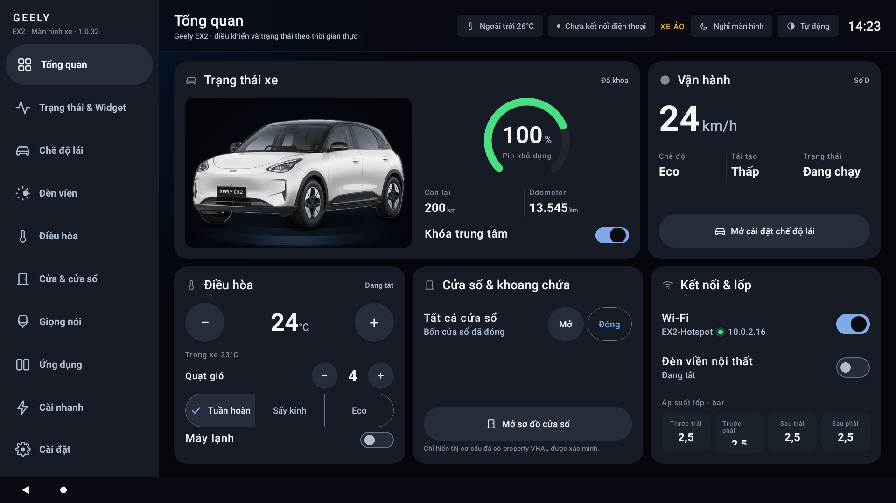 
  Giao diện Tổng quan: Pin %, Tốc độ, Khóa trung tâm, Điều hòa, Áp suất lốp 4 bánh

- **Thông số lên thanh trạng thái**: pin % (SOC), tốc độ km/h, nhiệt độ ngoài trời — kèm widget
  launcher, chỉnh vị trí từng biểu tượng (Rank 1..30).
- **Chế độ lái & Tái sinh năng lượng**: Eco / Comfort / Sport + mức hồi năng lượng — tự nhớ & khôi phục khi bật màn hình xe.
- **Đèn viền nội thất**: bật/tắt + lịch hẹn giờ ban đêm (chạy ngầm kể cả sau reboot).
- **Độ sáng đèn pha**: tự động theo điều kiện ánh sáng ngoài trời và đèn xe.
- **AVAS**: tắt tiếng bíp cảnh báo người đi bộ an toàn + chỉnh âm lượng loa.

---

#### 2. Chế độ lái & Đèn viền nội thất

  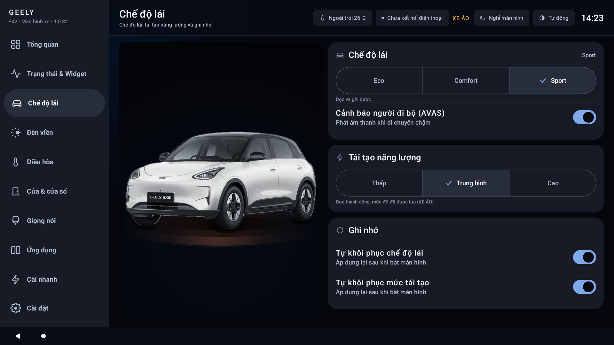
  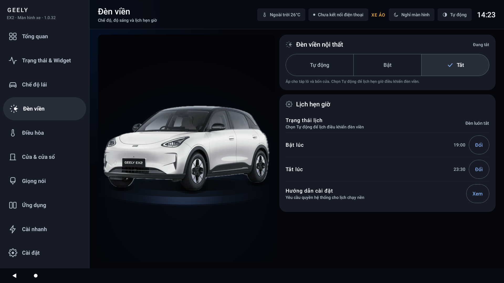 
  (Trái) Chế độ lái Sport & Tái tạo năng lượng · (Phải) Đèn viền nội thất & Lịch hẹn giờ ban đêm

- **Chế độ lái**: Chuyển đổi linh hoạt Eco / Comfort / Sport, điều chỉnh mức hồi năng lượng (Thấp / Trung bình / Cao).
- **Tự động nhớ & khôi phục**: Tự động phục hồi chế độ lái và mức tái tạo năng lượng sau mỗi lần khởi động xe.
- **Đèn viền nội thất thông minh**: Bật/tắt dải đèn viền táp-lô và 4 cánh cửa, cài đặt lịch hẹn giờ tự động bật lúc 19:00 và tắt lúc 23:30.

---

#### 3. Điều hòa Đa bước & Sơ đồ Cửa/Kính 3D

  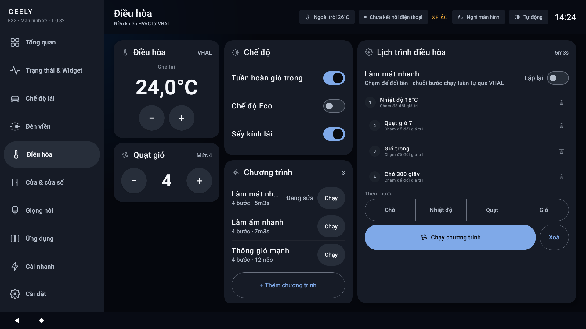
  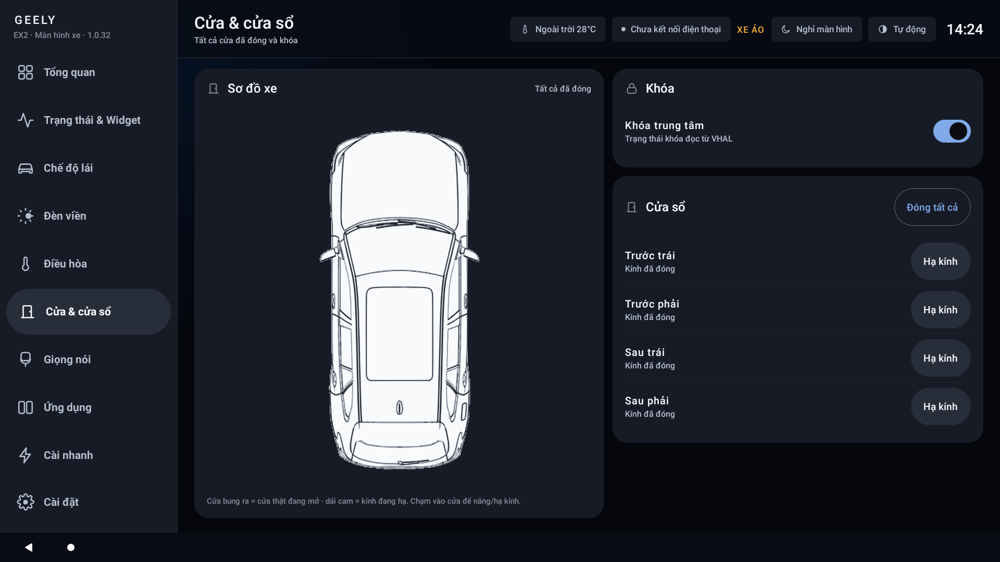 
  (Trái) Bảng điều khiển Điều hòa & Lập trình chuỗi tác vụ · (Phải) Sơ đồ xe 3D điều khiển kính từng góc

- **Điều hoà ngay trên xe**: A/C, nhiệt độ ±0.5°C, quạt gió, tuần hoàn gió trong, chế độ nhanh ECO, sấy kính lái.
- **Tự động chống gió ngoài**: Tắt máy lạnh A/C tự động chuyển sang chế độ gió trong (**Recirculation = ON**).
- **Lịch trình điều hòa đa bước (AC Program)**: Lập trình chuỗi tác vụ làm mát nhanh, làm ấm, thông gió tự động.
- **Sơ đồ xe 3D trực quan**: hiển thị cửa mở và trạng thái hạ kính từng góc (FL, FR, RL, RR), phím nâng/hạ kính và đóng tất cả cửa sổ.
- **Cửa & kính tự động**: hé kính 20% khi mở cửa, đóng kín khi đóng cửa (tự động khóa an toàn khi xe chạy).

---

#### 4. Trợ lý Giọng nói Tiếng Việt Offline & Kho Cài Nhanh

  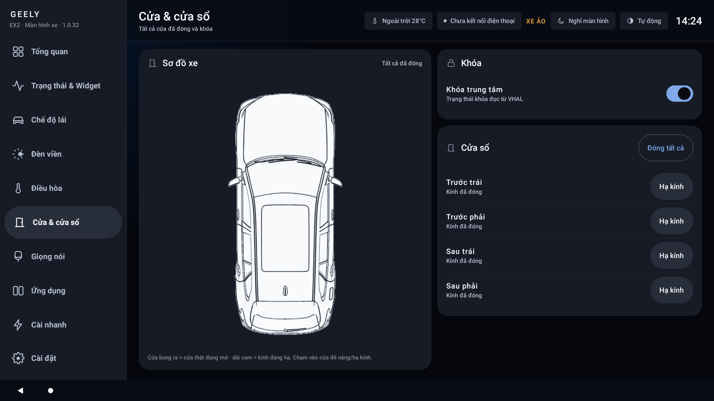
  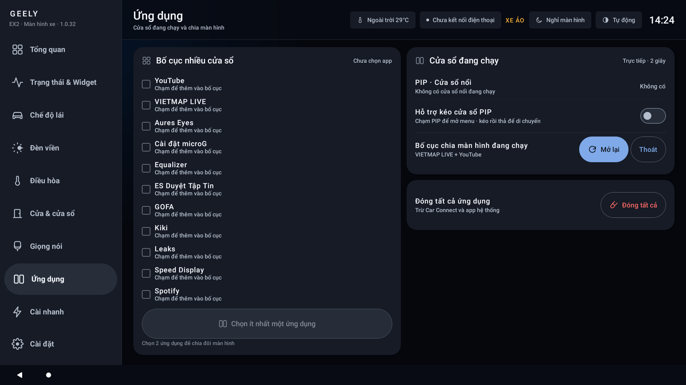 
  (Trái) Trợ lý giọng nói tiếng Việt Offline (Vosk TTS/ASR) · (Phải) Kho 17 ứng dụng Cài nhanh 1-chạm

- **Giọng nói tiếng Việt offline**: 75 lệnh điều khiển + 15 câu hỏi trả lời bằng giọng nói (query TTS), nhận dạng offline (Vosk) 95% chính xác.
- **Kho 17 Ứng dụng Cài Nhanh (v11)**: VietMap Live, Waze, SmartTube, YouTube Morphe, Spotify, Zalo... tải và cài 1-chạm không cần máy tính.
- **Cứu hộ PIP & Chia đôi màn hình**: Hỗ trợ kéo thả cửa sổ SmartTube PIP không bị liệt cảm ứng, chia đôi màn hình 1:1 cho VietMap Live + YouTube.
- **Watchdog chống crash/bootloop**: bảo vệ 3 tiến trình (`:main`, `:core`, `:watchdog`) ổn định 24/7.

---

### 📱 Phone Connect — app điện thoại (Android · iOS)

  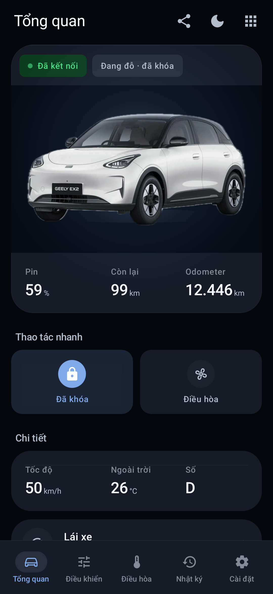
  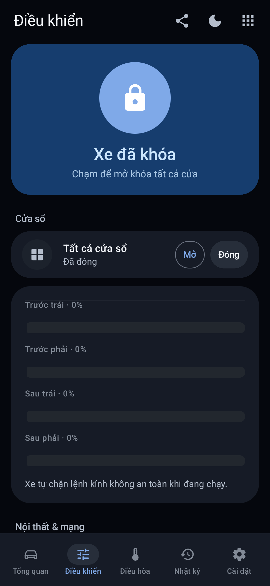
  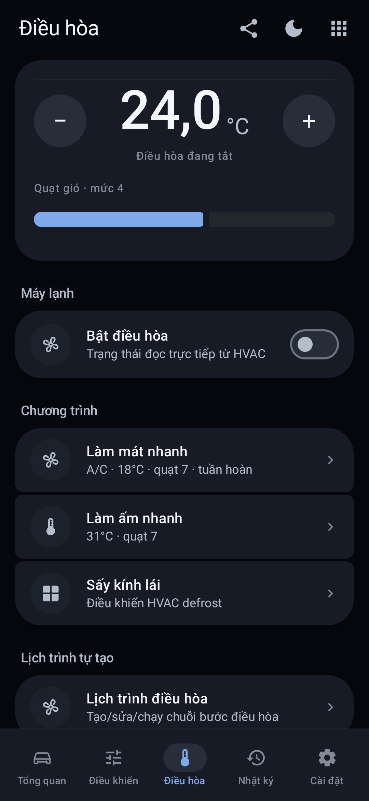
  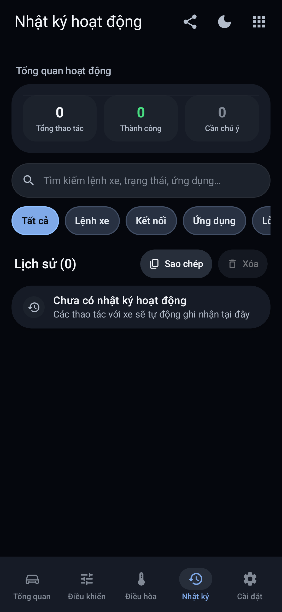
  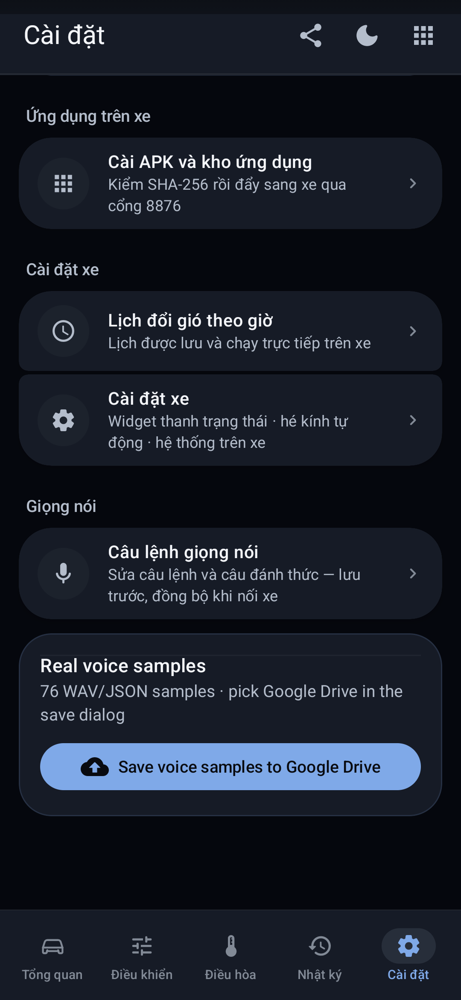 
  5 Tab trên PhoneConnect: Tổng quan · Điều khiển · Điều hoà · Nhật ký · Cài đặt

- **5 tab chính**: **Tổng quan · Điều khiển · Điều hoà · Nhật ký · Cài đặt** — hỗ trợ cả Android và iOS (Compose Multiplatform).
- **3 cách kết nối xe**: Bluetooth SPP / WiFi cùng mạng (TCP `:44700`) / Cloud Relay (4G) — tự dò xe, tự reconnect, chạy nền.
- **Tổng quan**: tốc độ + pin %, chế độ lái, nhiệt độ ngoài trời, gear, odometer, **áp suất lốp 4 bánh**, khoá/mở nhanh.
- **Điều khiển xe từ điện thoại**: khoá/mở cửa, kính từng cửa (% mở từng bánh FL/FR/RL/RR), đèn viền, WiFi xe.
- **Điều hoà thông minh**: A/C, nhiệt độ ±0.5°C, quạt gió, tuần hoàn gió trong, chạy các chương trình điều hòa tự động đa bước.
- **Nhật ký hoạt động (Audit Log & Telemetry)**: Lưu trữ và theo dõi toàn bộ lịch sử gửi/nhận lệnh điều khiển, trạng thái kết nối xe (Bluetooth/WiFi/Cloud), thống kê thành công/lỗi, lọc theo danh mục và sao chép log nhanh.
- **Giọng nói**: xem/sửa lệnh thoại theo nhóm, đổi câu đánh thức (wake word), đồng bộ 2 chiều với xe.
- **Cài APK lên xe không cần ADB**: đẩy file APK từ điện thoại lên xe qua HTTP `:8876`.
- **Đồng bộ cài đặt xe**: rank widget thanh trạng thái, hé kính tự động từng cửa, khôi phục chế độ lái/regen, đổi cổng mạng.

---

### 💻 PCConnect — app máy tính (macOS / Windows)

- **Quét tìm xe tự động (Network Scan)**: quét dải mạng subnet /24 tìm IP màn hình xe qua cổng `:44700` chỉ trong 3 giây.
- **Cứu hộ qua ADB**: hướng dẫn mở khoá, tự tính mã kỹ thuật theo giờ, kiểm tra kết nối — adb nhúng sẵn trong app.
- **Tab ⚡ Cài nhanh**: bấm 1 nút là tải + cài (SmartTube, Waze, VietMap…) — hỗ trợ link GitHub / Google Drive / tải trực tiếp.
- **Cài từ file / folder**: kéo-thả APK, XAPK, APKs, tự động trích xuất thư mục đồ họa OBB vào đúng `/sdcard/Android/obb/`.
- **Quản lý package trên xe**: ẩn/hiện app (không mất dữ liệu), gỡ cài đặt app hệ thống an toàn.
- **Công cụ thiết bị**: chia màn hình 2 app, gỡ kẹt PIP (chuyển pinned stack về fullscreen), chạy lệnh shell tuỳ ý.
- **Hệ thống cấp mã kích hoạt (Supabase)**: tạo mã license, quản lý người dùng, xử lý offline grace-period.

---

## 🔌 Sơ đồ kết nối

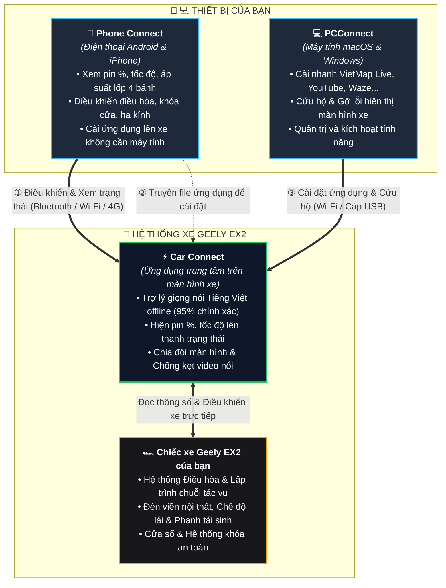

### 📋 Các cách kết nối & Sử dụng:

| Kênh kết nối | Phương thức | Mục đích sử dụng cho người dùng |
|---|---|---|
| **Điều khiển & Giám sát xe** | `Bluetooth` · `Wi-Fi` · `4G trực tuyến` | Xem mức pin %, áp suất lốp 4 bánh, điều chỉnh điều hòa, mở/khóa cửa và hạ kính thuận tiện ngay từ điện thoại khi xe đang bật (ACC / nổ máy). |
| **Cài ứng dụng từ điện thoại** | `Wi-Fi nội bộ` | Chọn và gửi file ứng dụng trực tiếp từ điện thoại lên màn hình xe để cài đặt ngay lập tức. |
| **Cài ứng dụng & Cứu hộ từ máy tính** | `Wi-Fi` · `Cáp USB` | Cài đặt ứng dụng trọn gói (VietMap Live, YouTube, Spotify...), cứu hộ màn hình và quản lý hệ thống. |

---

## 🛡️ Cổng Chặn An Toàn & Thông Báo Người Dùng

Hệ thống tích hợp sẵn các cơ chế bảo vệ an toàn chủ động khi xe đang lưu thông trên đường. Mọi thao tác bị chặn đều được **thông báo bằng tiếng Việt rõ ràng** trên màn hình xe hoặc điện thoại:

| Tình huống chặn / Xác nhận an toàn | Nguyên nhân an toàn | Phản hồi tới người dùng (Điện thoại / Màn hình xe) |
|---|---|---|
| **Kính / Khóa cửa khi xe đang chạy** | Vận tốc $>3\text{ km/h}$ hoặc Cần số $\ne$ P | 📱 Hiện thông báo: *"Thao tác này chỉ dùng khi xe đang đỗ an toàn"* 🎙️ Trợ lý xe hỏi lại: *"Bạn có chắc muốn thực hiện khi xe đang chạy không?"* $\rightarrow$ Người lái nói *"Đồng ý"* là xe thực hiện ngay. |
| **Chế độ lái khi xe đang chạy** *(Eco / Comfort / Sport)* | Thay đổi độ nhạy chân ga / công suất động cơ khi đang lăn bánh | 📱 Chuyển chế độ mượt mà từ điện thoại. 🎙️ Trợ lý giọng nói hỏi xác nhận: *"Bạn có chắc muốn chuyển sang chế độ [Sport/Eco/Comfort] khi xe đang chạy không?"* $\rightarrow$ Nói *"Đồng ý"* là xe đổi ngay. |
| **Phanh tái sinh khi xe đang chạy** *(Hồi năng lượng 1/2/3)* | Thay đổi độ ghì phanh khi nhả chân ga | 📱 Chuyển mức phanh tái sinh từ điện thoại. 🎙️ Trợ lý giọng nói hỏi xác nhận: *"Bạn có chắc muốn đổi mức phanh tái sinh khi xe đang chạy không?"* $\rightarrow$ Nói *"Đồng ý"* là xe đổi ngay. |
| **Cài đặt ứng dụng khi xe đang chạy** | Vận tốc $\ge 3\text{ km/h}$ | 📱 Hiện thông báo: *"Xe đang di chuyển — chỉ cài đặt ứng dụng khi xe đã dừng/đỗ"* |
| **Bố cục chia 3 ứng dụng** | Chia 3 app cùng lúc | 📱 / 🖥️ Hiện thông báo: *"Bố cục 3 ứng dụng chỉ khả dụng khi xe đang đỗ an toàn"* *(Chia đôi 2 app vẫn hoạt động bình thường)* |
| **Điều hòa khi xe tắt máy & khóa kín** | Xe ngủ sâu / Ngắt cao áp | 📱 Hiện thông báo: *"Xe đang ngủ · mở ACC hoặc nổ máy để điều hòa nhận lệnh"* |
| **Sai mã kết nối bảo mật** | Mã bảo mật không khớp | 📱 Hiện thông báo: *"Sai token bảo mật · sửa ở Cài đặt → Kết nối"* |
| **Mất kết nối với xe** | Mất sóng / Ngắt mạng | 📱 Hiện thông báo: *"Chưa kết nối với xe · kiểm tra Wi-Fi, Bluetooth hoặc Cloud"* |

> [!NOTE]
> **💡 LƯU Ý VỀ CƠ CHẾ XÁC NHẬN AN TOÀN 2 BƯỚC (TÍNH NĂNG BẢO VỆ CHỦ ĐỘNG — KHÔNG PHẢI LỖI):**
> Khi xe đang lăn bánh trên đường ($> 3\text{ km/h}$), hệ thống **bắt buộc yêu cầu xác nhận 2 bước** đối với 3 nhóm thao tác phần cứng nhạy cảm: **Hạ kính**, **Chuyển chế độ lái (Driving Mode)** và **Mức phanh tái sinh (Regen Level)**.
> - **Mục đích thiết kế**: Bảo vệ tối đa cho người lái, ngăn ngừa triệt để tình huống nhận diện nhầm tiếng ồn hoặc thao tác vô ý làm thay đổi đột ngột chân ga, lực phanh ghì hay gió lốc tạt vào cabin khi đang chạy tốc độ cao.
> - **Cách thao tác**: Khi nghe trợ lý xe hỏi lại (*"Bạn có chắc muốn thực hiện khi xe đang chạy không?"*), bạn chỉ cần nói tự nhiên: **"Đồng ý"** hoặc **"Đúng"** $\rightarrow$ Xe sẽ thực thi lệnh ngay lập tức!

---

## 🔒 Cam Kết An Toàn Tuyệt Đối — Không Can Thiệp Hệ Thống Gốc

Hệ thống ứng dụng được thiết kế theo tiêu chuẩn **Zero-System-Impact (Hoàn toàn không can thiệp sâu / Không xâm lấn hệ thống)**:

- 🛡️ **Tuyệt đối KHÔNG đụng / can thiệp phân vùng `/system`**: Không can thiệp root, không remount, không ghi đè bất kỳ file nào vào hệ điều hành gốc của xe. Giữ nguyên 100% cơ chế bảo mật và bảo hành của nhà sản xuất.
- 🚗 **KHÔNG can thiệp hệ thống điều khiển lái / ECU chuyên sâu**: Ứng dụng chỉ giao tiếp qua cổng API tiện ích tiêu chuẩn của Android Automotive (VHAL) để đọc thông số hiển thị (pin %, tốc độ, nhiệt độ) và điều khiển các tiện nghi (điều hòa, nâng/hạ kính, đèn viền, âm lượng).
- 🔄 **An toàn tuyệt đối — Gỡ bỏ là sạch 100%**: Ứng dụng hoạt động độc lập như một app Android thông thường. Nếu có bất kỳ lỗi nào hoặc khi không muốn dùng nữa, **bạn chỉ cần gỡ app (Uninstall) là xe lập tức trở về trạng thái nguyên bản 100% của nhà máy** mà không để lại bất kỳ ảnh hưởng nào!

---

## 🛠 Cách cài

- **Lên xe (Car Connect):** dùng PCConnect trên máy tính (mục Cài nhanh / Cài app) cài `CarConnect.apk`.
- **Lên điện thoại (Phone Connect):** tải `PhoneConnect.apk`, cho phép cài từ nguồn không rõ (Cài đặt → Bảo mật), cài như APK thường. Mở app → chọn transport Bluetooth / WiFi / Cloud để kết nối xe.
- **Trên máy tính (PCConnect):** tải `.dmg` (Mac) hoặc `.exe` (Windows) → mở app → trình duyệt tự mở `http://localhost:8848` → dùng được ngay; muốn thêm tính năng thì **kích hoạt mã**.

---

## 🔑 Kích hoạt mở thêm gì?

**Bộ app này không miễn phí — cần mã kích hoạt.** Mã do quản trị viên cấp, kích hoạt bằng
**mã + số điện thoại** (1 mã = 1 người, 1 máy mặc định). Xin mã trong
[nhóm Zalo](https://zalo.me/g/knl7dndglibpuzclc4vg).

Riêng PCConnect cho dùng trước phần cài app cho xe / quản lý file khi chưa kích hoạt;
kích hoạt sẽ mở thêm:
- **Công cụ thiết bị** — công cụ quản trị chuyên sâu trên xe
- **Mục VietMap Live** trong Cài nhanh
- **Hệ thống đồng bộ giấy phép nâng cao**

---

## 📣 Báo lỗi / góp ý

- Vào nhóm Zalo để trao đổi, báo lỗi, góp ý trực tiếp: **[zalo.me/g/knl7dndglibpuzclc4vg](https://zalo.me/g/knl7dndglibpuzclc4vg)**
- Khi báo lỗi, kèm theo: đang chạy bản nào, thao tác gì thì lỗi, ảnh chụp màn hình (nếu chụp được).
